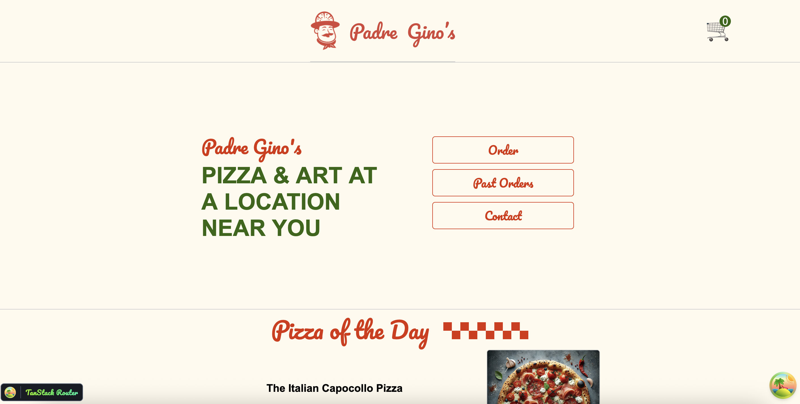
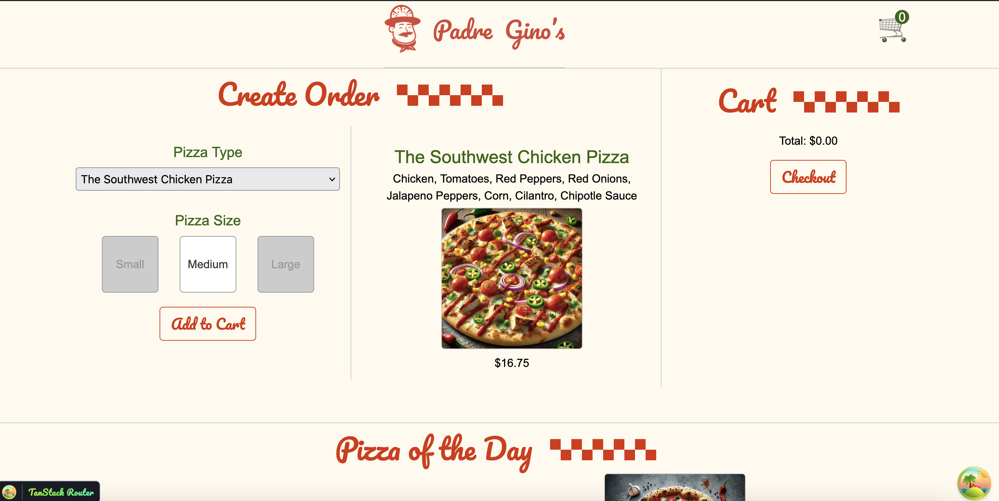
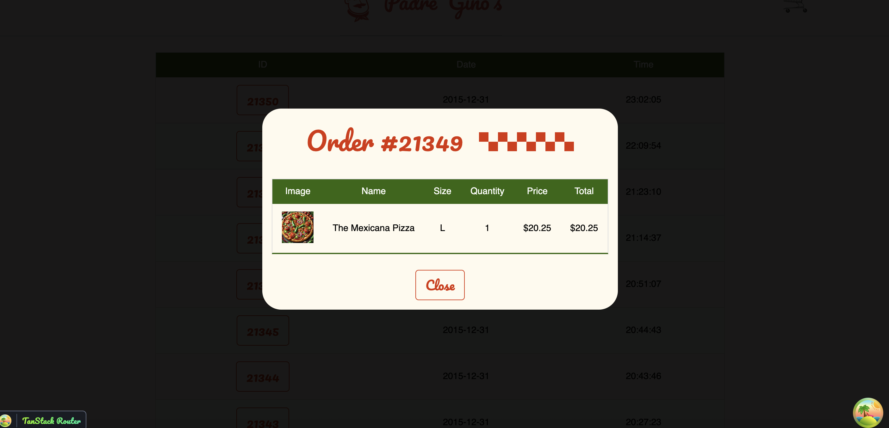
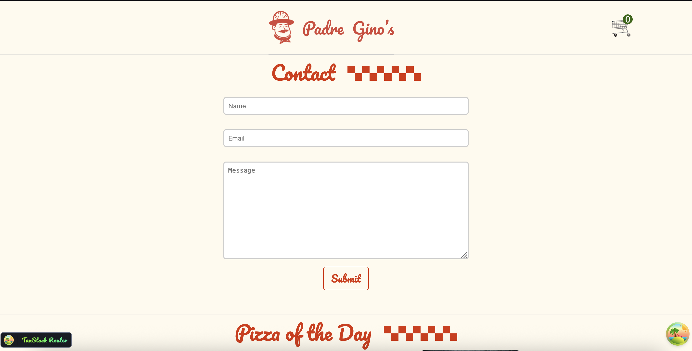

# 🍕 Padre Gino's Pizza App

A full-stack pizza ordering application built using **React**, **Express**, and **SQLite**.

## 🚀 Features

- 🍕 Browse and order delicious pizzas
- 🛒 Cart system using React Context
- 📋 Customer form with validation
- 🔄 Backend with Express and SQLite
- 🔍 Data fetching with React Query
- 🧭 Routing with @tanstack/react-router
- 💡 Modals, custom hooks, and more

## 📦 Tech Stack

- Frontend: React, Vite, @tanstack/react-query, React Context
- Backend: Node.js, Express, SQLite

## 🧑‍💻 How to Run Locally

### Frontend

```bash
cd padre-ginos-pizza
npm install
npm run dev

## 📸 Screenshots

### 🏠 Home Page


### 🛒 Order Page


### 📜 Past Orders


### ✉️ Contact Page

